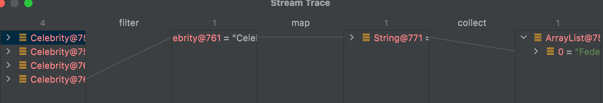

# Getting Started

    Code Samples to demonstrate
        1. Functional Interface
        2. Streams
        3. Method References
        4. Optional 
        5. Map
        6. FlatMap

### Imperative v Declarative Approach

	    1. Filtering the list by Imperative approach ( declaring temp list to hold the filtered values )
        2. Filtering the list by Declarative Approach ( using Streams and filters )
        Refer to ImperativeDemo and DeclartiveDemo class

## Functional Interface

    Interface having only one abstract method

    Using Functional Interface :
            Predicate  - Functional Interface to take one argument and do return boolen value
            Function   - FI to take one argument and return it
            Chaining of Functions - Chain Functions to do one or more operations , output of one is fed to another function ( PIPE )
                eg : apply(), andThen() and thenCompose()
                
    
    Function Interface : Takes one argument and returns one
                         Pass argument using apply() method
                         Refer to FuncInterfaceDemo

    BiFunction Interface :  Takes two argument and returns one 
                            Pass argument using apply() method
                            Refer to FuncInterfaceDemo

    Consumer Interface : Takes one argument and returns no argument. 
                         To pass argument to consumer interface,use accept(T t) method
                         Refer to ConsumerFuncDemo class
    
    Predicate Interface : Takes one argument and returns Boolean value
                          Pass argument using test()
                          Refer to PredicateFuncDemo class
    
    Supplier Interface : Takes no argument and returns one
                            Refer to SupplierFuncDemo class

## Streams 

    
    
    Brings functional programming to Java
    Uses Lambda expressions

    Using Java Streams to filter the list based on predicate
     Streams will have three parts
     1. Source to Operate i.e Input , it can be list
     2. Intermediate Operations : it can be filter, map,sort,allMatch, anyMatch etc
     3. Terminal Operations ( collectors, forEach )

## Optional

    - Better way of Handling Null Check
    - Avoid potential Null Pointer Exception
    - Avoid boilerplate coding

## Map
    Used in tandem with streams api to map the element ( do transformation ) operation
    Refer to MapDemo class 

## FlatMap
    Used to flatten the 2D list to single dimensional list and do mapping operation
    Refer to FlatMapDemo class

## Method Reference

    Method Reference is denoted by ClassName :: MethodName
                    for eg :  sorted(Comparator.comparing(Celebrity::getName))  // here Celebrity is the class name followed
                              by :: and then by method name i.e getName
